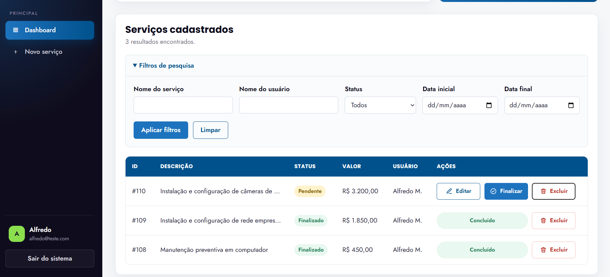

# Sistema de Controle de Serviços

Sistema web desenvolvido para gerenciar os serviços prestados pelos funcionários da JM Informática.

A aplicação utiliza PHP orientado a objetos, arquitetura MVC própria, MySQL com PDO e JavaScript puro. O projeto não utiliza frameworks, Composer ou gerenciadores externos de dependências.

## Visão do sistema

O dashboard reúne os indicadores do usuário autenticado, os últimos serviços pendentes e o gerenciamento dos registros.


A área de gerenciamento permite pesquisar serviços por descrição, usuário, status e período, além de editar, finalizar ou excluir os registros.



## Funcionalidades implementadas

- Cadastro de usuários;
- Autenticação por e-mail e senha;
- Controle de acesso por sessão;
- Encerramento seguro da sessão;
- Dashboard com informações do usuário autenticado;
- Indicadores individuais de valores, serviços pendentes e finalizados;
- Cadastro de serviços para o usuário autenticado;
- Listagem dos serviços e seus responsáveis;
- Edição de serviços pendentes;
- Exclusão de serviços com confirmação personalizada;
- Finalização de serviços;
- Registro da data de finalização;
- Cálculo automático da comissão;
- Notificação por e-mail após a finalização;
- Filtro por descrição do serviço;
- Filtro por nome do usuário;
- Filtro por status;
- Filtro por período;
- Mensagens temporárias de sucesso e erro;
- Proteção CSRF nos formulários;
- Registro local de erros e tentativas de e-mail;
- Interface responsiva para computadores, tablets e celulares.

## Regras de negócio

### Status do serviço

O status é definido pela data de finalização:

- Sem data de finalização: `Pendente`;
- Com data de finalização: `Finalizado`.

Depois de finalizado, o serviço não pode mais ser editado pela aplicação.

### Comissão

A comissão é calculada no momento da finalização:

| Valor do serviço | Comissão |
|---|---:|
| Até R$ 1.000,00 | 5% |
| Acima de R$ 1.000,00 até R$ 10.000,00 | 10% |
| Acima de R$ 10.000,00 | 20% |

Exemplos:

| Serviço | Percentual | Comissão |
|---:|---:|---:|
| R$ 800,00 | 5% | R$ 40,00 |
| R$ 2.500,00 | 10% | R$ 250,00 |
| R$ 12.000,00 | 20% | R$ 2.400,00 |

### Indicadores do dashboard

Os cards e a lista de pendências consideram somente os serviços do usuário autenticado.

A tabela geral apresenta os serviços de todos os funcionários. Os filtros aplicados à tabela não alteram os indicadores individuais.

## Tecnologias utilizadas

- PHP 8;
- MySQL;
- PDO;
- HTML5;
- CSS3;
- JavaScript;
- Arquitetura MVC;
- Servidor interno do PHP.

## Restrições respeitadas

- Sem framework de backend;
- Sem framework de frontend;
- Sem Composer;
- Sem ORM;
- Consultas realizadas diretamente com PDO;
- JavaScript sem bibliotecas externas.

## Estrutura do projeto

```text
projeto/
├── app/
│   ├── Controllers/
│   ├── Core/
│   ├── Models/
│   ├── Services/
│   └── Views/
├── config/
│   └── database.example.php
├── database/
│   └── schema.sql
├── docs/
│   └── images/
├── public/
│   ├── assets/
│   │   ├── css/
│   │   └── js/
│   └── index.php
├── storage/
│   └── logs/
├── .gitignore
└── README.md
```

### Responsabilidades

- `app/Controllers`: recebe as requisições e coordena as operações;
- `app/Core`: contém roteamento, autenticação, CSRF, autoload e conexão;
- `app/Models`: executa consultas e alterações no banco;
- `app/Services`: concentra regras como comissão e envio de e-mail;
- `app/Views`: contém as páginas apresentadas ao usuário;
- `config`: contém o modelo de configuração do banco;
- `database`: contém o script de criação das tabelas;
- `docs/images`: armazena as imagens utilizadas na documentação;
- `public`: ponto de entrada e arquivos públicos;
- `storage/logs`: armazena os registros locais da aplicação.

## Requisitos

Antes de iniciar, verifique se estão instalados:

- PHP 8 ou superior;
- MySQL;
- Git;
- Extensão PHP `PDO`;
- Extensão PHP `pdo_mysql`;
- Extensão PHP `session`.

Para conferir as extensões disponíveis:

```powershell
php -m
```

## Instalação

### 1. Clonar o repositório

```powershell
git clone https://github.com/AlfredoMelloDev/teste-tecnico-titan-software-PHP-MYSQL.git
cd teste-tecnico-titan-software-PHP-MYSQL
```

### 2. Iniciar o servidor MySQL

Antes de criar o banco de dados, certifique-se de que o MySQL esteja instalado e em execução.

A forma de inicialização depende de como ele foi instalado.

#### Instalação pelo Scoop ou versão portátil

Abra um PowerShell separado e execute:

```powershell
mysqld --console
```

Aguarde até aparecer:

```text
ready for connections
```

Mantenha esse terminal aberto enquanto estiver utilizando o banco de dados. Abra outro terminal para executar as próximas etapas.

#### MySQL instalado como serviço do Windows

Pressione `Win + R`, digite:

```text
services.msc
```

Procure por um serviço com nome semelhante a `MySQL`, `MySQL80` ou `MySQL90`.

Se estiver parado, clique com o botão direito e selecione **Iniciar**.

#### XAMPP ou WampServer

Abra o painel do programa e inicie o módulo **MySQL**.

> Se aparecer `ERROR 2003 (HY000): Can't connect to MySQL server`, o servidor não está em execução ou não está acessível. Inicie-o e tente novamente.

### 3. Criar e importar o banco de dados

#### Qual usuário devo utilizar?

O usuário solicitado nesta etapa é uma conta do **MySQL**. Ele não é o usuário do Windows, do GitHub ou do sistema desenvolvido.

Na maioria das instalações locais, o usuário administrativo padrão é:

```text
root
```

A senha é aquela definida durante a instalação do MySQL. Se nenhuma senha tiver sido configurada, pressione `Enter` quando ela for solicitada.

Se você já utiliza MySQL Workbench, SQLTools, XAMPP, WampServer ou outro gerenciador, consulte as configurações da conexão existente para identificar o usuário e a porta utilizados.

> O usuário escolhido precisa ter permissão para criar bancos e tabelas. Caso contrário, a importação apresentará a mensagem `Access denied`.

No VS Code, abra um novo terminal e execute o seguinte comando para entrar com o usuário padrão `root`:

```powershell
mysql -h 127.0.0.1 -P 3306 -u root -p
```

Se você utiliza outro usuário administrativo, substitua `root` pelo nome correspondente.

Significado das opções:

- `-h 127.0.0.1`: endereço do servidor MySQL local;
- `-P 3306`: porta padrão do MySQL;
- `-u root`: usuário utilizado na conexão;
- `-p`: solicita a senha de forma segura.

Após executar o comando, aparecerá:

```text
Enter password:
```

Digite a senha do MySQL e pressione `Enter`. Por segurança, nenhum caractere será exibido durante a digitação.

Se o usuário não possuir senha, apenas pressione `Enter`.

Quando a conexão for realizada corretamente, o terminal mostrará:

```text
mysql>
```

#### Importar o script

Com o terminal exibindo `mysql>` e no arquivo database.example.php os campos username(root) e password(\*campo vazio) ajustados, execute o arquivo `database/schema.sql` através do caminho completo da pasta em que o projeto foi salvo:

```sql
SOURCE C:/caminho/completo/do/projeto/database/schema.sql
```

Exemplo no Windows:

```sql
SOURCE C:/Users/SEU_NOME/Documents/teste-titan/database/schema.sql
```

Substitua o caminho do exemplo pelo local em que o projeto foi salvo em sua máquina.

Caso não saiba o caminho completo do arquivo, abra outro terminal do PowerShell na raiz do projeto e execute:

```powershell
Resolve-Path .\database\schema.sql
```

O PowerShell apresentará o caminho completo. Copie esse caminho e substitua as barras `\` por `/` antes de utilizá-lo no comando `SOURCE`.

No comando `SOURCE`:

- utilize o caminho completo até o arquivo `schema.sql`;
- utilize barras `/`, mesmo no Windows;
- não coloque ponto e vírgula no final;
- mantenha o primeiro terminal do MySQL aberto durante a importação.

O script cria automaticamente o banco `teste_titan`, seleciona esse banco e cria as tabelas, os índices e os relacionamentos necessários.

Para confirmar que a importação foi concluída, execute:

```sql
USE teste_titan;
SHOW TABLES;
```

O resultado deverá apresentar estas tabelas:

```text
service
user
```

Para sair do MySQL, execute:

```sql
EXIT;
```

#### Possíveis erros durante a importação

Se aparecer a mensagem `Failed to open file`, verifique se:

- o caminho informado corresponde à pasta em que o projeto foi salvo;
- o arquivo `database/schema.sql` existe;
- o caminho contém todas as pastas necessárias;
- as barras foram escritas como `/`;
- não foi colocado `;` no final do comando `SOURCE`.

Se aparecer a mensagem `Access denied`, o usuário utilizado não possui permissão para criar ou acessar o banco.

Nesse caso, saia do MySQL:

```sql
EXIT;
```

Depois, conecte-se novamente utilizando o usuário `root` ou outra conta administrativa:

```powershell
mysql -h 127.0.0.1 -P 3306 -u root -p
```

Se aparecer uma mensagem informando que não foi possível conectar ao servidor MySQL, confirme que o servidor foi iniciado conforme explicado na etapa anterior.

Se o comando `mysql` não for reconhecido no PowerShell, verifique se o MySQL está instalado e se sua pasta `bin` está configurada na variável de ambiente `PATH`.

Como alternativa, abra o arquivo `database/schema.sql` no SQLTools ou no MySQL Workbench e execute-o utilizando uma conexão com permissão para criar bancos.

> As credenciais do arquivo `config/database.php` serão configuradas na próxima etapa. Esse arquivo não interfere na execução do comando `SOURCE`.


#### Qual usuário devo utilizar?

O usuário solicitado nesta etapa é uma conta do **MySQL**. Ele não é o usuário do Windows, GitHub ou do sistema desenvolvido.

Na maioria das instalações locais, o usuário administrativo padrão é:

```text
root
```

A senha é aquela definida durante a instalação do MySQL. Se nenhuma senha tiver sido configurada, pressione `Enter` quando ela for solicitada.

Se você já utiliza MySQL Workbench, SQLTools, XAMPP ou outro gerenciador, pode conferir o usuário nas configurações da conexão existente.

O usuário utilizado precisa ter permissão para criar bancos e tabelas.


No VSCode, para entrar com o usuário padrão `root`, execute em um novo terminal:

```VSCODE
mysql -h 127.0.0.1 -P 3306 -u root -p
```

Se você utiliza outro usuário administrativo, substitua `root` pelo nome correspondente.

Significado das opções:

- `-h 127.0.0.1`: endereço do servidor MySQL local;
- `-P 3306`: porta padrão do MySQL;
- `-u root`: usuário da conexão;
- `-p`: solicita a senha de forma segura.

Após executar o comando, aparecerá:

```text
Enter password:
```

Digite a senha do MySQL e pressione `Enter`. Por segurança, nenhum caractere será exibido durante a digitação.

Se a conexão funcionar, o terminal mostrará:

```text
mysql>
```

#### Importar o script

Depois de acessar o MySQL com o usuário `root` ou outra conta com permissão para criar bancos, o terminal deverá exibir:

```text
mysql>
```

Execute o arquivo `database/schema.sql` utilizando o caminho completo da pasta em que o projeto foi salvo:

```sql
SOURCE C:/caminho/completo/do/projeto/database/schema.sql
```

Exemplo no Windows:

```sql
SOURCE C:/Users/SEU_NOME/Documents/teste-titan/database/schema.sql
```

> Substitua o caminho do exemplo pelo local em que o projeto foi salvo em sua máquina.

No comando `SOURCE`:

- utilize barras `/`, mesmo no Windows;
- não coloque ponto e vírgula no final do caminho;
- utilize uma conta do MySQL com permissão para criar bancos, como `root`.

O script cria automaticamente o banco `teste_titan`, seleciona esse banco e cria as tabelas, os índices e os relacionamentos necessários.

Para confirmar que a importação foi concluída, execute:

```sql
USE teste_titan;
SHOW TABLES;
```

O resultado deverá apresentar estas tabelas:

```text
service
user
```

Para sair do MySQL, execute:

```sql
EXIT;
```

Se aparecer a mensagem `Failed to open file`, confira se:

- o caminho informado corresponde à pasta em que o projeto foi salvo;
- o arquivo `database/schema.sql` existe;
- não foi colocado `;` no final do comando `SOURCE`.

Se aparecer `Access denied`, o usuário utilizado não possui permissão para criar ou acessar o banco. Saia do MySQL com `EXIT;` e conecte-se novamente utilizando o usuário `root` ou outra conta administrativa:

```powershell
mysql -h 127.0.0.1 -P 3306 -u root -p
```

Se o comando `mysql` não for reconhecido no PowerShell, verifique se o MySQL está instalado e se sua pasta `bin` está configurada no `PATH`. Como alternativa, abra o arquivo `database/schema.sql` no SQLTools ou no MySQL Workbench e execute-o utilizando uma conexão com permissão para criar bancos.

### 4. Configurar a conexão

Crie uma cópia do arquivo de exemplo.

No PowerShell:

```powershell
Copy-Item config/database.example.php config/database.php
```

No Linux ou macOS:

```bash
cp config/database.example.php config/database.php
```

Edite `config/database.php` com as credenciais do MySQL instalado na sua máquina:

```php
<?php

declare(strict_types=1);

return [
    'host' => '127.0.0.1',
    'port' => '3306',
    'database' => 'teste_titan',
    'charset' => 'utf8mb4',
    'username' => 'seu_usuario',
    'password' => 'sua_senha',
];
```

Substitua:

- `seu_usuario`: pelo usuário do MySQL utilizado na etapa anterior;
- `sua_senha`: pela senha correspondente a esse usuário.

Esse usuário precisa possuir acesso ao banco `teste_titan`.

O arquivo `config/database.php` está no `.gitignore` e não deve ser enviado ao repositório.

### 5. Verificar a conexão

Antes de executar o teste, confirme que o arquivo `config/database.php` contém as credenciais do MySQL instalado em sua máquina.

> A aplicação utiliza o arquivo `config/database.php`. O arquivo `config/database.example.php` serve apenas como modelo e não é carregado pelo sistema.

Na raiz do projeto, execute:

```powershell
php -r "require 'app/Core/Database.php'; App\Core\Database::connection(); echo 'Conexao PDO realizada com sucesso.' . PHP_EOL;"
```

O resultado esperado é:

```text
Conexao PDO realizada com sucesso.
```

Se ocorrer algum erro, verifique:

- se o servidor MySQL está em execução;
- se o banco `teste_titan` foi criado;
- se o arquivo `config/database.php` existe;
- se o nome do banco está definido como `teste_titan`;
- se o usuário e a senha informados estão corretos;
- se o usuário possui permissão para acessar o banco;
- se a extensão `pdo_mysql` está habilitada no PHP.

O erro `Access denied` indica que o usuário ou a senha estão incorretos, ou que o usuário informado não possui acesso ao banco. Nesse caso, abra `config/database.php` e informe as mesmas credenciais utilizadas para acessar o MySQL durante a importação.

Para verificar se a extensão `pdo_mysql` está habilitada, execute:

```powershell
php -m | Select-String "pdo_mysql"
```

Se estiver habilitada, o terminal exibirá:

```text
pdo_mysql
```
```

### 6. Iniciar a aplicação

Na raiz do projeto, execute:

```powershell
php -S 127.0.0.1:8000 -t public public/index.php
```

Acesse no navegador:

```text
http://127.0.0.1:8000
```

Mantenha o terminal aberto enquanto estiver utilizando o sistema.

### 7. Criar o primeiro usuário

Na página de login:

1. Clique em **Cadastrar usuário**;
2. Informe nome, e-mail e senha;
3. Conclua o cadastro;
4. Entre com as credenciais criadas.

O projeto não fornece senhas ou usuários fixos.

## Verificação da sintaxe

Para verificar um arquivo:

```powershell
php -l public/index.php
```

Para verificar todos os arquivos PHP no PowerShell:

```powershell
Get-ChildItem -Recurse -Filter *.php | ForEach-Object {
    php -l $_.FullName
}
```

## Envio de e-mail

Quando um serviço é finalizado, a aplicação tenta enviar uma notificação ao usuário responsável.

O envio utiliza a função nativa `mail()` do PHP e depende da configuração de e-mail do servidor.

Em ambientes locais sem essa configuração, o serviço é finalizado normalmente e a tentativa fica registrada em:

```text
storage/logs/mail.log
```

Para consultar o arquivo no Windows PowerShell:

```powershell
Get-Content .\storage\logs\mail.log -Tail 20 -Encoding UTF8
```

Em produção, o servidor deve possuir um transporte de e-mail configurado.

## Segurança

O projeto utiliza:

- `password_hash()` para armazenamento das senhas;
- `password_verify()` durante a autenticação;
- Renovação do identificador da sessão após o login;
- Consultas preparadas com PDO;
- Emulação de prepared statements desabilitada;
- Tokens CSRF nas requisições `POST`;
- Escape de conteúdo com `htmlspecialchars`;
- Validação dos dados recebidos;
- Controle de acesso às páginas autenticadas;
- Credenciais locais ignoradas pelo Git;
- Erros técnicos registrados fora da interface.

## Banco de dados

O script solicitado para criação das tabelas está disponível em:

```text
database/schema.sql
```

As tabelas principais são:

- `user`: armazena usuários e credenciais;
- `service`: armazena serviços, valores, finalização, comissão e responsável.

## Autor

Desenvolvido por [Alfredo Mello](https://github.com/AlfredoMelloDev).